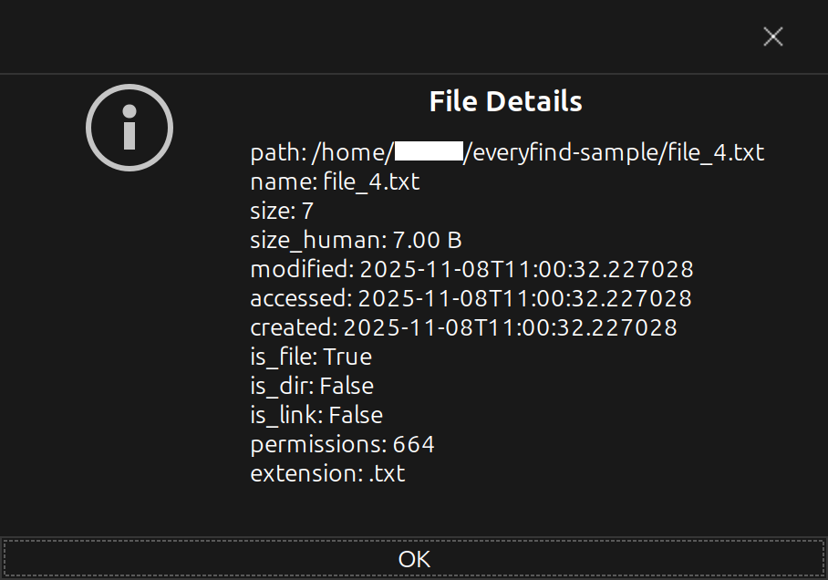

git clone https://github.com/deinname/everyfind.git
everyfind index /pfad/zum/durchsuchen
git clone https://github.com/deinname/everyfind.git
everyfind index /pfad/zum/durchsuchen
everyfind search
everyfind gui
<!--
Everyfind – ultraschnelle Dateisuche für Linux
Copyright (C) 2025 Stefan

This program is free software: you can redistribute it and/or modify
it under the terms of the GNU General Public License as published by
the Free Software Foundation, either version 3 of the License, or
(at your option) any later version.

This program is distributed in the hope that it will be useful,
but WITHOUT ANY WARRANTY; without even the implied warranty of
MERCHANTABILITY or FITNESS FOR A PARTICULAR PURPOSE. See the
GNU General Public License for more details.

You should have received a copy of the GNU General Public License
along with this program. If not, see <https://www.gnu.org/licenses/>.
-->

# Everyfind

[](https://github.com/Wacken2012/everyfind/actions/workflows/build.yml)

🇩🇪 Deutsch | 🇬🇧 English

## 🇩🇪 Deutsch

Everyfind ist eine ultraschnelle Dateisuche für Linux, inspiriert von "Everything" unter Windows. Es kombiniert die Geschwindigkeit von `fzf` mit einer GTK-Oberfläche und bietet sowohl eine CLI- als auch eine GUI-Oberfläche.

Features
- CLI- und GUI-Modus (GTK)
- Fuzzy-Suche mit `fzf` (über PTY)
- Schnelle Indexierung mit SQLite
- AppImage-fähig, Raspberry Pi tauglich (ARM)

Hinweis zur Entstehung
Die Architektur dieses Projekts wurde gemeinsam mit einer KI (Microsoft Copilot) entworfen. Teile des Codes wurden mithilfe von GitHub Copilot in VS Code generiert. Alle von Copilot erzeugten Teile wurden überprüft und angepasst.

Installation (lokal)

1. Klonen und Build-Skript ausführen (erzeugt AppImage):

```bash
git clone https://github.com/yourname/everyfind.git
cd everyfind
./build.sh x86_64      # oder: ./build.sh aarch64
```

2. Entwicklung (virtuelle Umgebung):

```bash
python3 -m venv .venv
source .venv/bin/activate
pip install -r requirements.txt
pip install -e .
```

Häufige Befehle

```bash
everyfind index /pfad/zum/durchsuchen    # Index erstellen
everyfind search                         # Interaktive fzf-Suche (CLI)
everyfind gui                            # GTK-GUI starten
everyfind stats                          # Statistik über Index
everyfind clear                          # Index löschen
```

Lizenz
Dieses Projekt steht unter der GNU General Public License v3 (GPLv3). Siehe `LICENSE` im Repository.

Mitwirken
Wenn du beitragen möchtest, siehe `CONTRIBUTING.md` für Hinweise zum Entwicklungsworkflow, Code-Stil und Pull-Requests.

## 🇬🇧 English

Everyfind is a blazing-fast file search tool for Linux, inspired by "Everything" on Windows. It combines `fzf` speed with a GTK interface and provides both CLI and GUI frontends.

Features
- CLI and GUI (GTK)
- Fuzzy search powered by `fzf` (via PTY)
- Fast indexing using SQLite
- AppImage-ready, Raspberry Pi (ARM) support

Note on development
The architecture of this project was co-designed with AI (Microsoft Copilot). Portions of the code were generated using GitHub Copilot in VS Code and have been reviewed and adapted.

Installation (local)

1. Clone and run the build script (produces AppImage):

```bash
git clone https://github.com/yourname/everyfind.git
cd everyfind
./build.sh x86_64      # or: ./build.sh aarch64
```

2. Development (virtualenv):

```bash
python3 -m venv .venv
source .venv/bin/activate
pip install -r requirements.txt
pip install -e .
```

Common commands

```bash
everyfind index /path/to/index   # create index
everyfind search                 # interactive fzf search (CLI)
everyfind gui                    # launch GTK GUI
everyfind stats                  # show index stats
everyfind clear                  # clear index
```

License
Everyfind is released under the GNU General Public License v3 (GPLv3). See `LICENSE`.

Contributing
See `CONTRIBUTING.md` for contribution guidelines, coding style, and the pull request workflow.

---

## 🖼️ Screenshots

### Hauptfenster


### Dateidetails


If you use or distribute Everyfind, please respect the licenses of bundled components (e.g., fzf: MIT, PyGObject: LGPL, SQLite: Public Domain). If you have questions about licensing, open an issue.
